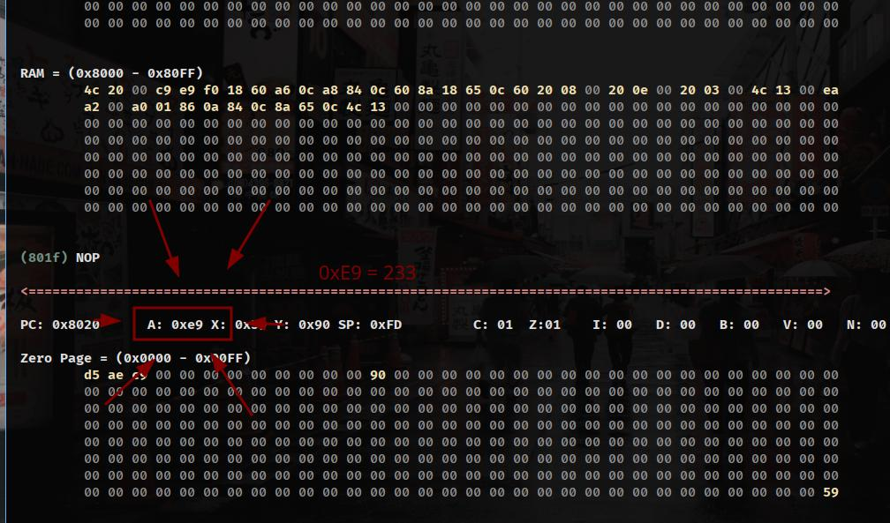

# MOS6502

Para utilizar:
 - Abra o repositório e digite "make" para compilar o software

 - Após compilar, surgirá um binário "6502"

 - Que pode ser utilizado com o argumento "-p" para passar "programas" escritos em machine code de MOS6502

 - Todos os programas exemplos residem no diretório "./samples/". Arquivos que não possuem extensão, ou possuem a extensão .bin podem ser passados como parâmetro no "./6502 -p"

 - Exemplo: "./6502 -p ./samples/assembly/fibonacci/fibonacci3.bin"

 - A sequência acima executará o programa que calcula a sequência de fibonacci até o décimo segundo número da sequência (233 ou 0xE9), visto que a CPU MOS6502 possui registradores internos para dados de 8 bits, sendo possível armazenar apenas valores menores que 256.

 - No caso, o décimo segundo número da sequência, o 233, é o que chega mais próximo de 256, o próximo número seria 377, que não cabe em um registrador de 8 bits. De qualquer maneira, seria possível trabalhar com números maiores utilizando o low byte e high byte, mas é conversa para outra hora

 - Após executar o programa da sequência de fibonacci, será possível visualizar o valor final calculado no registrador A (Accumulator), como visto na imagem abaixo:

 

 - É isso, sequência de fibonacci funcionando em um emulador de MOS6502 rodando machine code exclusivo de MOS6502.
